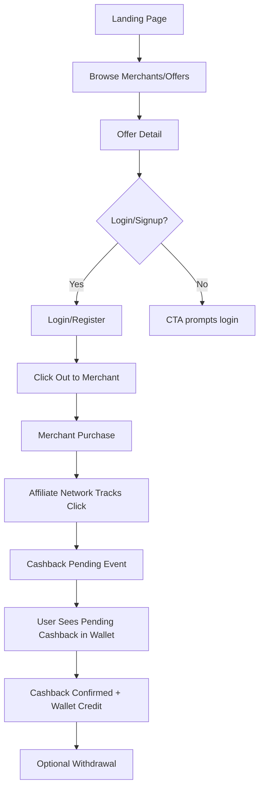
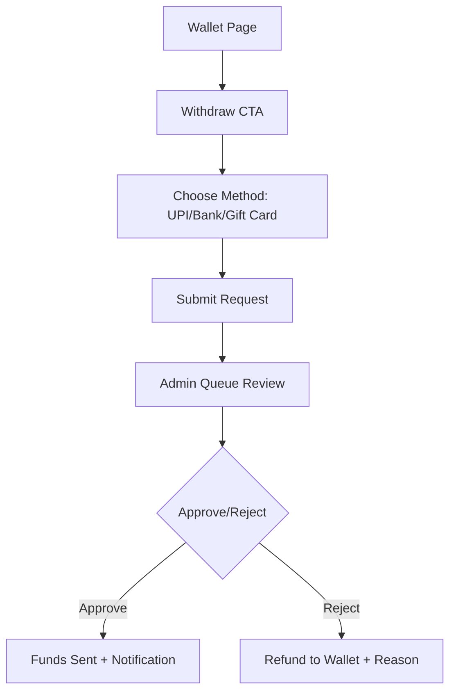
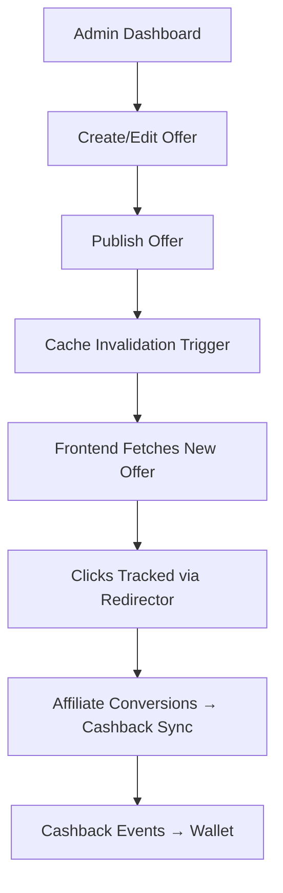
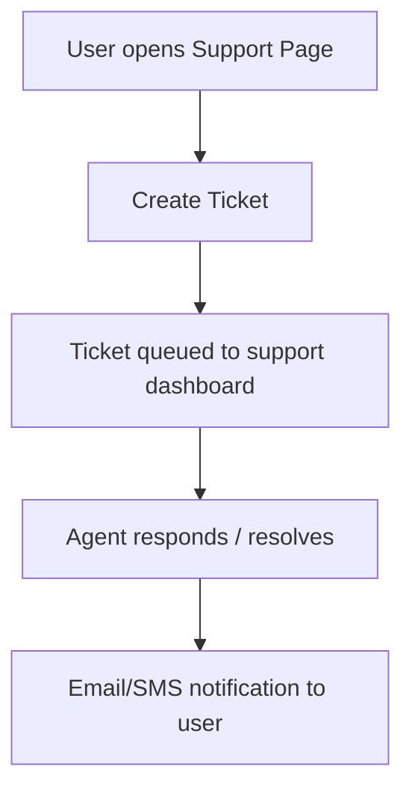

# User Journey Flows (Text Wireframes)

These flows capture the key paths for shoppers, logged-in users, and admins. Use them as a blueprint for design/UX and QA.

## Guest → Purchase with Cashback


## Gift Card Purchase (Logged-in)
```mermaid
flowchart TD
  A[Product Grid] --> B[Gift Card Detail]
  B --> C[Select Denomination/Quantity]
  C --> D[Add to Cart]
  D --> E[Cart Review]
  E --> F[Apply Promo / Wallet]
  F --> G[Create Order (Razorpay)]
  G --> H[Payment Success Webhook]
  H --> I[Voucher Codes Generated]
  I --> J[Email/SMS Delivery]
  J --> K[Order Detail Page Shows Codes]
```

## Withdrawal Flow


## Admin: Offer Lifecycle


## Support / Recovery

